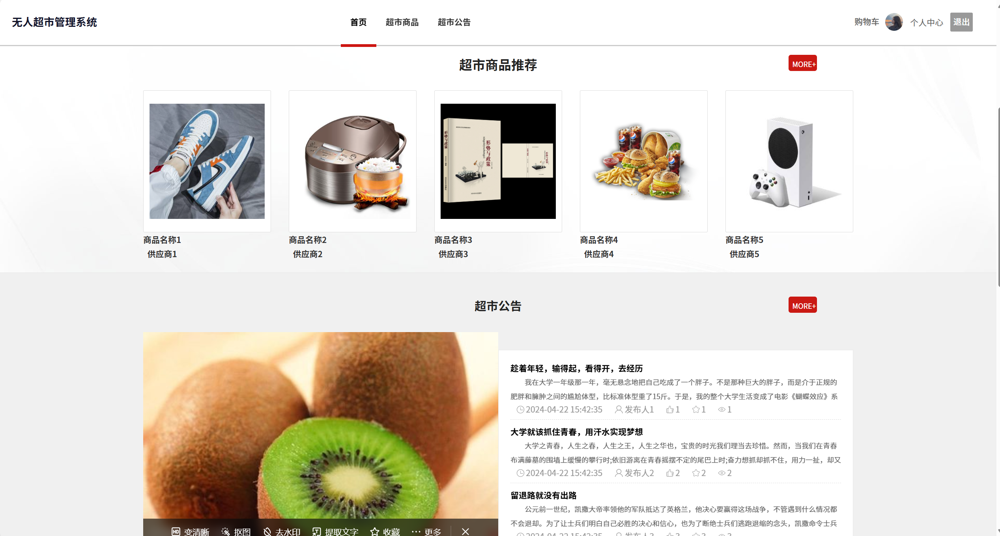
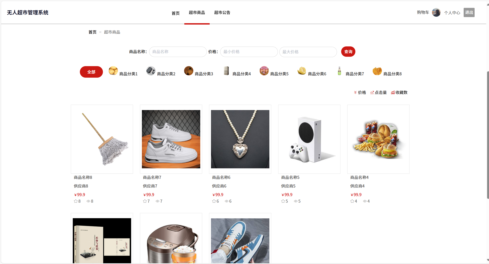
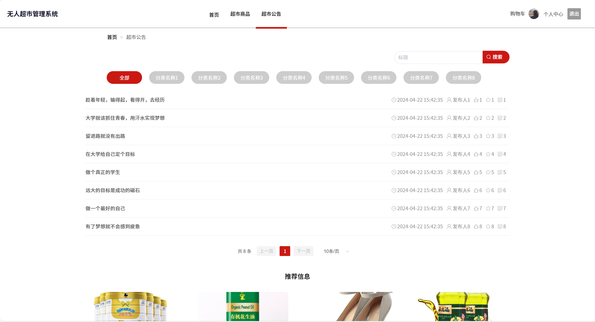
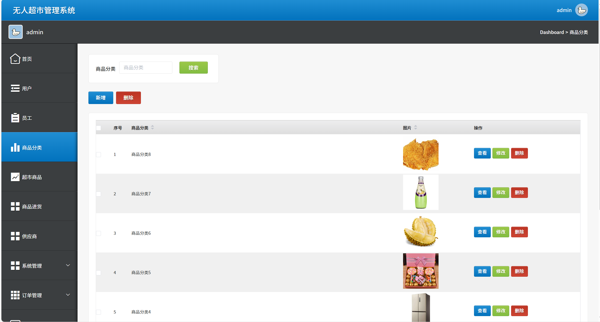
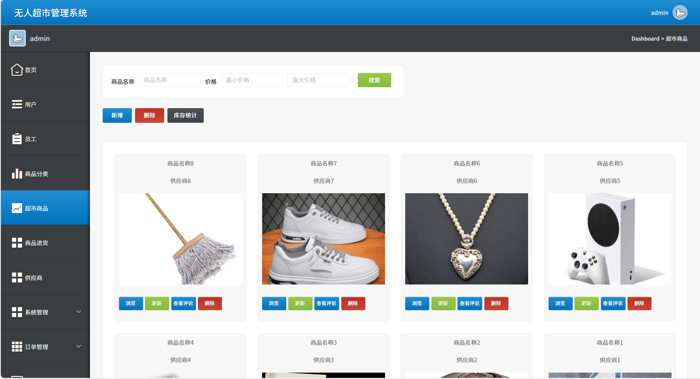
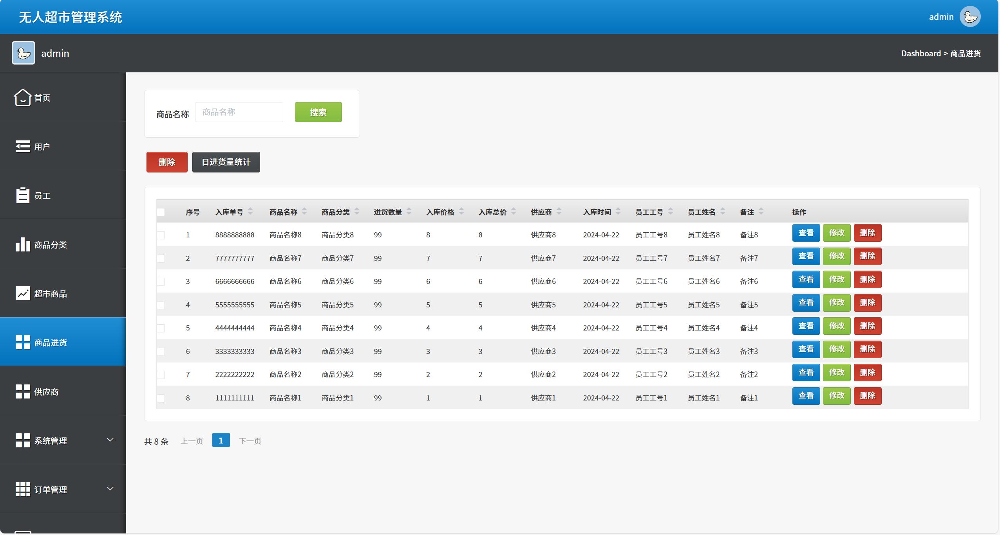
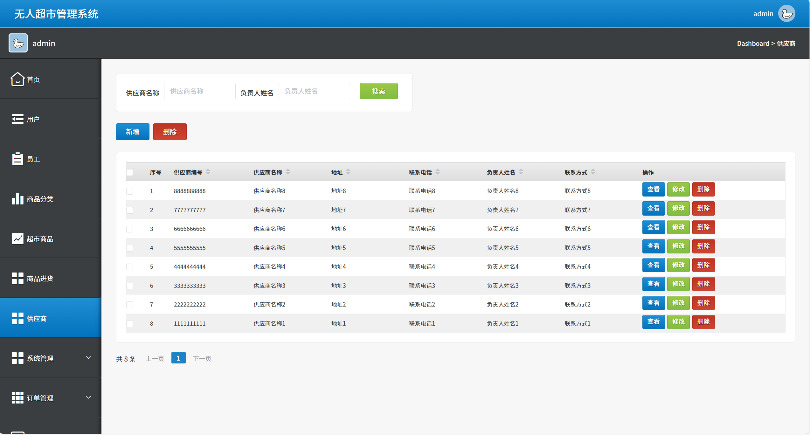

# python105
python105基于Python+Flask的超市管理系统
 
## 源码问题查看主页咨询

### 一、关键词
商超管理系统，超市信息管理系统，超市运营管理系统

### 二、作品包含
源码+数据库+全套环境和工具资源+本地部署教程

### 三、项目技术
前端技术：Html、Css、Js、Vue2.0、Element-ui
后端技术：Python3.7、Flask

### 四、运行环境（以下版本亲测，其他版本兼容性请自行测试）
开发工具：PyCharm + VSCODE

数据库：MySQL5.7（最低要5.7版本）

数据库管理工具：Navicat10+

Python：Python3.7

前端Nodejs：14

浏览器：谷歌浏览器

### 五、项目介绍
项目编号：python105

超市管理系统是通过数字化手段对超市的商品采购、库存、销售、收银及客户等核心业务环节进行一体化管理，以提升运营效率、优化库存结构、精准把控经营数据的工具。
首页：展示超市商品推荐与超市公告等内容，方便用户快速了解超市相关信息。
超市商品管理：可按商品名称、价格、分类等条件查询商品，还能对商品进行新增、删除、浏览、更新等操作，以及进行库存统计。
超市公告管理：能按标题、分类等搜索公告，查看公告的发布时间、发布人及互动情况等，也可进行分类筛选。
商品分类管理：支持对商品分类进行搜索、新增、删除，以及查看、修改、删除具体分类信息。
商品进货管理：可按商品名称搜索进货记录，能删除记录，还能统计日进货量，同时可对进货单进行查看、修改、删除操作。
供应商管理：能按供应商名称、负责人姓名搜索供应商，可新增、删除供应商，也能查看、修改、删除供应商信息。
用户与员工管理：可对用户和员工相关信息进行管理（图中未详细展示具体操作，但属于系统功能模块）。
系统与订单管理：包含系统设置及订单相关的管理功能（图中未详细展示具体操作，但属于系统功能模块）。
登录功能：提供管理员和员工两种身份的登录入口，验证用户名和密码以进入系统。

### 六、运行截图

 
